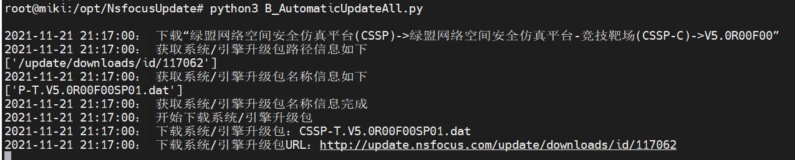

# NsfocusUpdate-README
>  NSFOCUS升级站点爬取升级包


## 1 概述

- 由于 [update.nsfocus.com](http://update.nsfocus.com) 升级站点下载升级包有速率限制，为了在急需升级包的时候能最快速度下载升级包，因此搭建了本地离线升级站点。

## 2 技术栈

- python 3.8.5

## 3 部署环境

- 基于ubuntu 18.04.6 LTS版本

### 3.1 下载NsfocusUpdate

```shell
root@localhost:~# cd /opt/
root@localhost:/opt# git clone https://github.com/mik1th0n/NsfocusUpdate.git
```

### 3.2 安装依赖包

```shell
root@localhost:/opt# cd NsfocusUpdate/
root@localhost:/opt/NsfocusUpdate# pip3 install requests
```

### 3.3 修改配置文件

- 修改 `UpdateGeneralDownload.py` 文件

```shell
root@localhost:/opt/NsfocusUpdate# vim UpdateGeneralDownload.py
```


- 将文件的61行、62行的数字 `1` 修改为 `150`


## 4 运行程序

### 4.1 运行选择单个产品升级包爬取程序

```python
root@localhost:/opt/NsfocusUpdate# python3 A_SelectAnUpdate.py
```


- 选择之后，自动执行爬取升级包时，代表程序执行成功

### 4.3 运行自动化爬取所有升级包程序

```python
root@localhost:/opt/NsfocusUpdate# python3 B_AutomaticUpdateAll.py
```

- 输出如下日志表示运行正常



## 5 批量删除升级包

### 5.1 Windows批量删除升级包

- 双击 `WindowsDeleteUpdateThePackage.bat` 运行删除


### 5.2 Linux批量删除升级包

```python
root@miki:/opt/NsfocusUpdate# sh LinuxDeleteUpdateThePackage.sh
```
